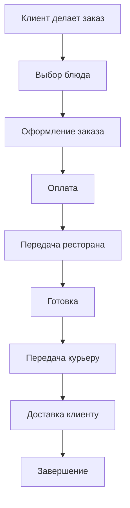
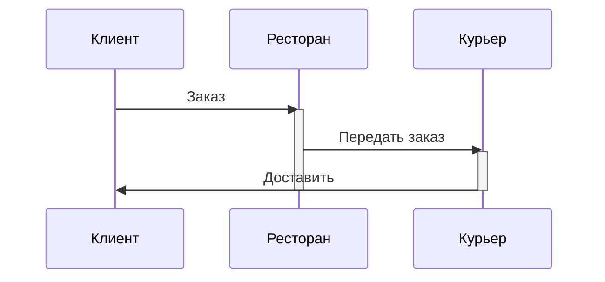
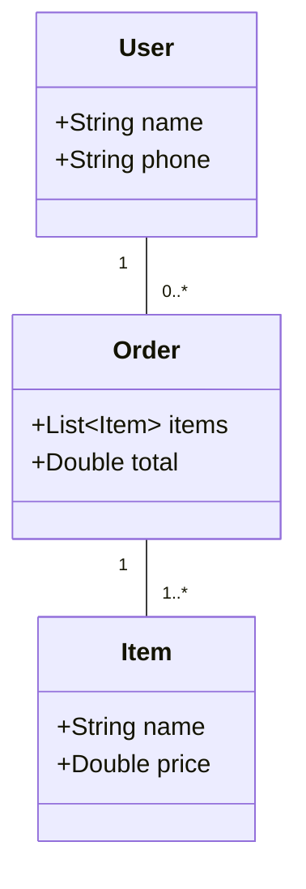
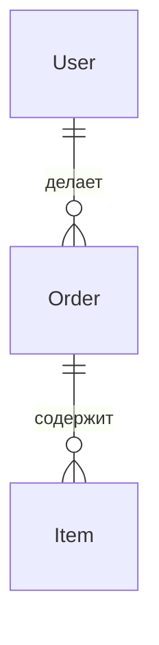
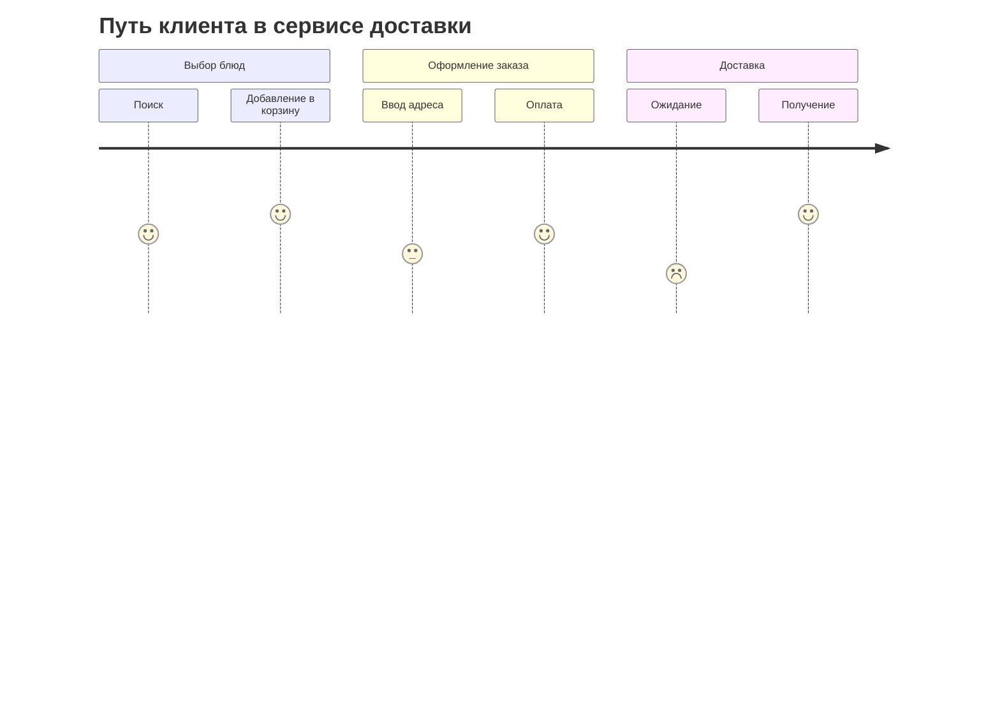
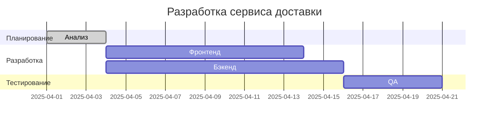

```mermaid
    graph TD
        A[Клиент делает заказ] --> B[Выбор блюда]
        B --> C[Оформление заказа]
        C --> D[Оплата]
        D --> E[Передача ресторана]
        E --> F[Готовка]
        F --> G[Передача курьеру]
        G --> H[Доставка клиенту]
        H --> I[Завершение]
```

```mermaid
    sequenceDiagram
    participant Клиент
    participant Ресторан
    participant Курьер

    Клиент->>Ресторан: Заказ
    activate Ресторан
    Ресторан->>Курьер: Передать заказ
    activate Курьер
    Курьер->>Клиент: Доставить
    deactivate Курьер
    deactivate Ресторан
```

```mermaid
classDiagram
    class User {
        +String name
        +String phone
    }

    class Order {
        +List~Item~ items
        +Double total
    }

    class Item {
        +String name
        +Double price
    }

    User "1" -- "0..*" Order
    Order "1" -- "1..*" Item
```

```mermaid
erDiagram
    User ||--o{ Order : "делает"
    Order ||--o{ Item : "содержит"
```

```mermaid
journey
    title Путь клиента в сервисе доставки
    section Выбор блюд
      Поиск: 4
      Добавление в корзину: 5
    section Оформление заказа
      Ввод адреса: 3
      Оплата: 4
    section Доставка
      Ожидание: 2
      Получение: 5
```

```mermaid
gantt
    title Разработка сервиса доставки
    dateFormat  YYYY-MM-DD
    section Планирование
    Анализ :done, anal, 2025-04-01, 3d
    section Разработка
    Фронтенд :front, 2025-04-04, 10d
    Бэкенд :back, 2025-04-04, 12d
    section Тестирование
    QA :qa, 2025-04-16, 5d
```