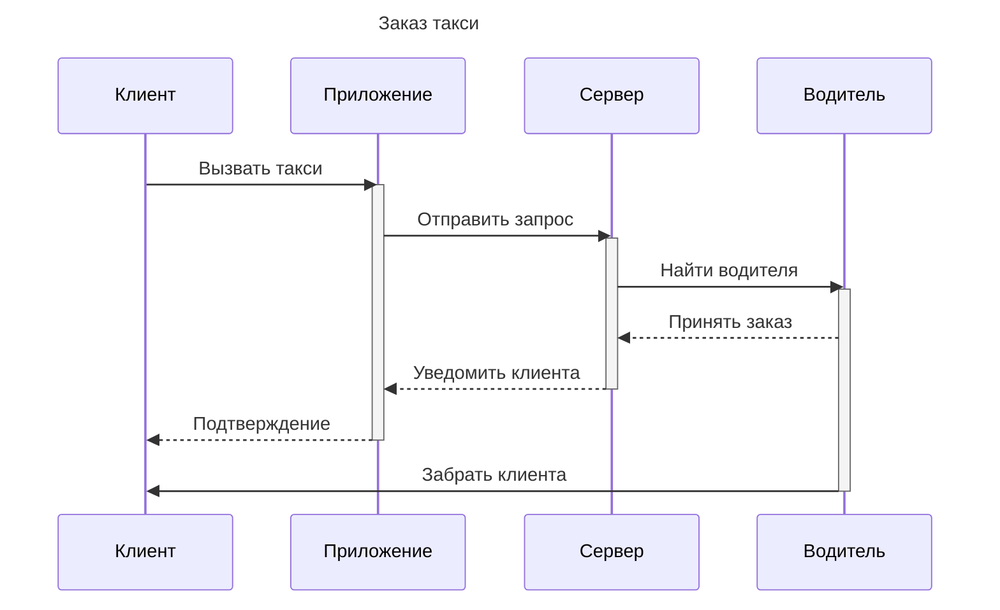

# 1.2

```mermaid
    sequenceDiagram
        title Заказ такси
        participant Клиент
        participant Приложение
        participant Сервер
        participant Водитель

        Клиент->>Приложение: Вызвать такси
        activate Приложение
        Приложение->>Сервер: Отправить запрос
        activate Сервер
        Сервер->>Водитель: Найти водителя
        activate Водитель
        Водитель-->>Сервер: Принять заказ
        Сервер-->>Приложение: Уведомить клиента
        deactivate Сервер
        Приложение-->>Клиент: Подтверждение
        deactivate Приложение
        Водитель->>Клиент: Забрать клиента
        deactivate Водитель
```