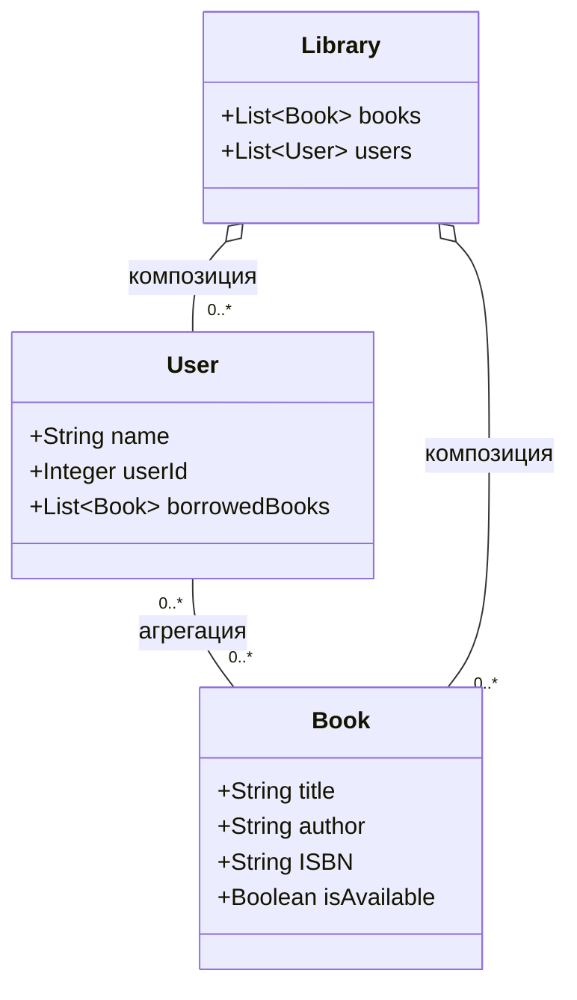

# 2.1

```mermaid
    classDiagram
        class Book {
            +String title
            +String author
            +String ISBN
            +Boolean isAvailable
        }

        class User {
            +String name
            +Integer userId
            +List~Book~ borrowedBooks
        }

        class Library {
            +List~Book~ books
            +List~User~ users
        }

        User "0..*" -- "0..*" Book : агрегация
        Library o-- "0..*" Book : композиция
        Library o-- "0..*" User : композиция
```