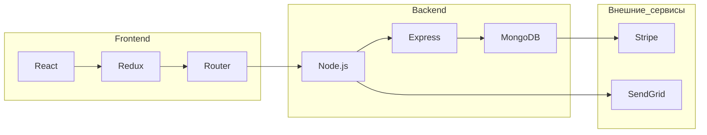

# 3.1

```mermaid
    graph LR
        subgraph Frontend
            A[React] --> B[Redux]
            B --> C[Router]
        end

        subgraph Backend
            D[Node.js] --> E[Express]
            E --> F[MongoDB]
        end

        subgraph Внешние_сервисы
            G[Stripe]
            H[SendGrid]
        end

        C --> D
        F --> G
        D --> H
```