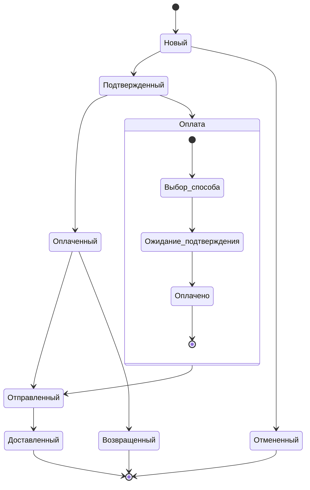

# 3.2

```mermaid
    stateDiagram-v2
        [*] --> Новый
        Новый --> Подтвержденный
        Подтвержденный --> Оплаченный
        Оплаченный --> Отправленный
        Отправленный --> Доставленный
        Доставленный --> [*]

        state Оплата {
            [*] --> Выбор_способа
            Выбор_способа --> Ожидание_подтверждения
            Ожидание_подтверждения --> Оплачено
            Оплачено --> [*]
        }

        Подтвержденный --> Оплата
        Оплата --> Отправленный

        Новый --> Отмененный
        Оплаченный --> Возвращенный
        Отмененный --> [*]
        Возвращенный --> [*]
```